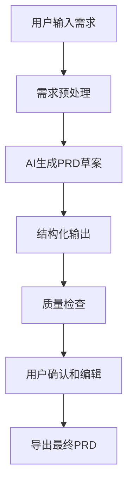

# 开发流程文档

## 🚀 开发环境设置

### 1. 环境准备
```bash
# 克隆项目
git clone <repository-url>
cd prompt-engineering-demo

# 安装依赖
npm install

# 环境配置
cp .env.example .env.local
# 编辑 .env.local 添加 API 密钥

# 数据库初始化
npm run db:push
npm run db:generate

# 启动开发服务器  
npm run dev
```

### 2. 开发规范

#### 代码结构
- `app/` - Next.js App Router页面和API
- `components/` - 可复用React组件
- `lib/` - 工具函数和服务
- `types/` - TypeScript类型定义

#### 命名约定
- 组件：PascalCase (`PromptDemo.tsx`)
- 文件：kebab-case (`ai-service.ts`)
- 变量：camelCase (`activeTab`)
- 常量：UPPER_CASE (`API_ENDPOINT`)

#### Git提交规范
```
feat: 新功能
fix: 修复bug
docs: 文档更新
style: 样式调整
refactor: 重构代码
test: 测试相关
chore: 构建配置
```

## 🏗️ 架构设计

### 前端架构
```
Next.js App Router
├── UI Layer (Tailwind + Framer Motion)
├── State Management (Zustand)
├── API Layer (Fetch + Error Handling)
└── Type Safety (TypeScript)
```

### 后端架构
```
API Routes (Next.js)
├── AI Service Layer
│   ├── OpenAI Integration
│   └── Anthropic Integration
├── Database Layer (Prisma)
└── Error Handling & Logging
```

### 数据流
```
User Input → Component → API Call → AI Service → Response → UI Update
                ↓
            Database (Session Storage)
```

## 📱 产品 PRD 生成流程

### 1. 需求收集阶段
- **用户输入**: 原始需求描述
- **上下文分析**: 业务背景、用户群体、约束条件
- **需求澄清**: AI辅助需求理解和补充

### 2. PRD生成流程


### 3. PRD模板结构
1. **产品概述** - 定位、目标、核心价值
2. **需求背景** - 问题分析、市场机会
3. **功能规格** - 详细功能描述、交互流程
4. **技术要求** - 架构约束、性能指标
5. **用户体验** - 界面设计、交互规范
6. **项目规划** - 时间安排、资源配置
7. **风险评估** - 技术风险、市场风险
8. **验收标准** - 功能验收、性能验收

### 4. 质量保证
- **完整性检查**: 确保所有章节内容完整
- **一致性验证**: 功能描述与技术要求一致
- **可实施性评估**: 技术可行性和资源合理性

## 🛠️ 开发最佳实践

### 1. 组件开发
```tsx
// 组件结构示例
interface ComponentProps {
  // 明确的类型定义
}

export function Component({ prop }: ComponentProps) {
  // 1. 状态管理
  const [state, setState] = useState();
  
  // 2. 副作用处理
  useEffect(() => {
    // 逻辑处理
  }, []);
  
  // 3. 事件处理函数
  const handleEvent = useCallback(() => {
    // 处理逻辑
  }, []);
  
  // 4. 渲染逻辑
  return (
    <div>
      {/* JSX 内容 */}
    </div>
  );
}
```

### 2. API开发
```typescript
// API路由结构
export async function POST(request: NextRequest) {
  try {
    // 1. 请求验证
    const body = await request.json();
    
    // 2. 业务逻辑处理
    const result = await processRequest(body);
    
    // 3. 响应返回
    return NextResponse.json({
      success: true,
      data: result
    });
  } catch (error) {
    // 4. 错误处理
    return NextResponse.json({
      success: false,
      error: error.message
    }, { status: 500 });
  }
}
```

### 3. 错误处理
- 用户友好的错误信息
- 完整的错误日志记录
- 优雅的降级处理
- 重试机制

### 4. 性能优化
- 组件懒加载
- 图片优化
- API响应缓存
- 数据库查询优化

## 🚦 发布流程

### 1. 代码检查
```bash
# 类型检查
npm run type-check

# 代码规范检查
npm run lint

# 构建测试
npm run build
```

### 2. 数据库迁移
```bash
# 生成迁移文件
npx prisma migrate dev

# 应用到生产
npx prisma migrate deploy
```

### 3. 部署到Vercel
```bash
# 自动部署（推送到main分支）
git push origin main

# 手动部署
vercel --prod
```

### 4. 监控和回滚
- 监控应用性能和错误率
- 准备回滚计划
- 用户反馈收集

## 📊 质量指标

### 性能指标
- 页面加载时间 < 3s
- API响应时间 < 2s
- Core Web Vitals优化

### 代码质量
- TypeScript严格模式
- 测试覆盖率 > 80%
- ESLint零警告

### 用户体验
- 界面响应时间 < 100ms
- 移动端适配良好
- 无障碍访问支持

## 🔧 故障排查

### 常见问题
1. **API调用失败** - 检查环境变量配置
2. **数据库连接错误** - 检查DATABASE_URL
3. **构建失败** - 检查依赖版本兼容性
4. **样式异常** - 检查Tailwind配置

### 调试工具
- Chrome DevTools
- Vercel Function Logs
- Prisma Studio
- VS Code调试器

## 📈 项目路线图

### 短期计划 (1个月)
- [ ] 用户系统集成
- [ ] 模板库扩展
- [ ] 性能优化

### 中期计划 (3个月)  
- [ ] 团队协作功能
- [ ] 多语言支持
- [ ] 高级分析面板

### 长期计划 (6个月)
- [ ] 模板市场
- [ ] 企业级功能
- [ ] AI模型扩展